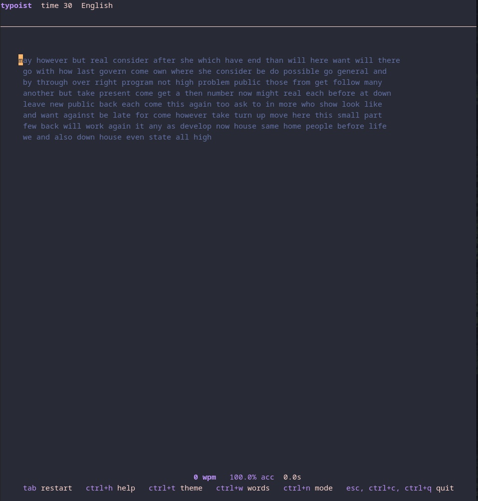
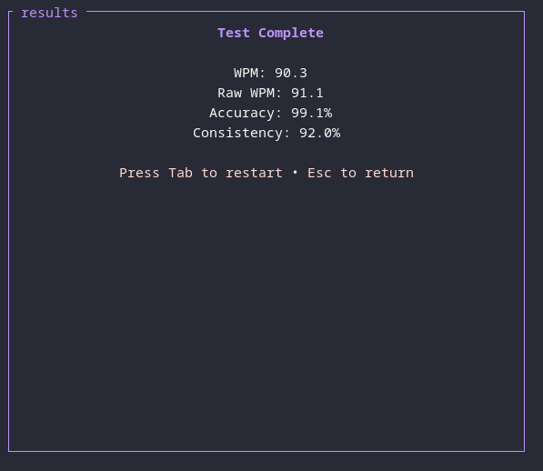
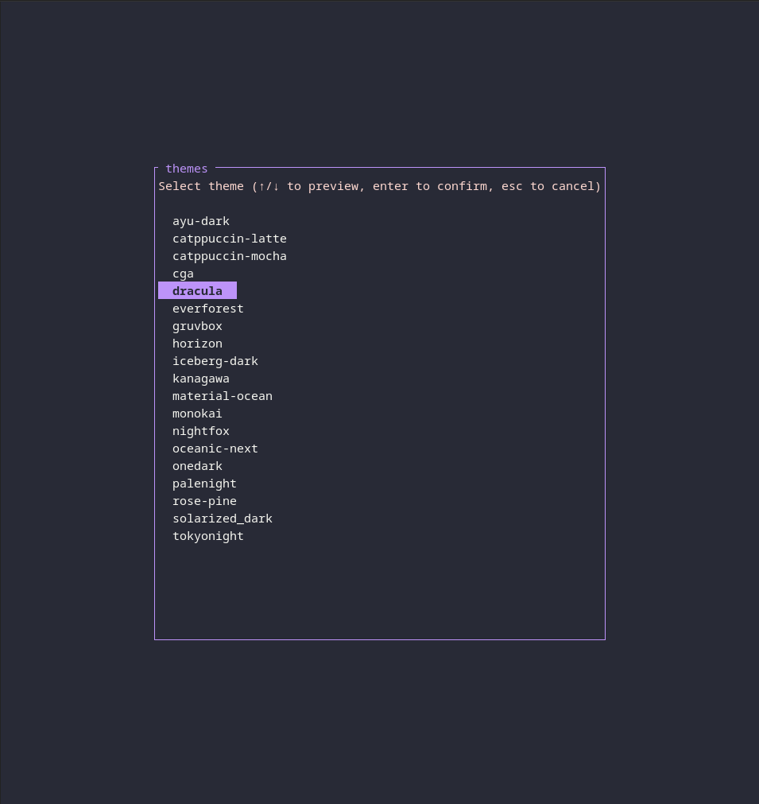
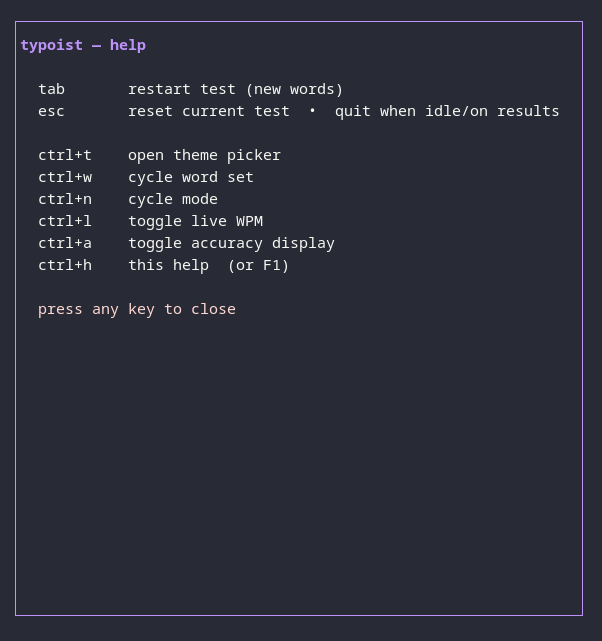

# typoist

A terminal typing test. No browser needed. Lightweight, simple, powerful.

Built in Rust with [Ratatui](https://github.com/ratatui/ratatui).

***Disclaimer***: On release 1.0.0, only the words mode works despite some of the code and help menus mentioning
later planned modes that i have not released yet


typoist in action





results





theme menu    





help screen





## Features

- **Variable time modes**: time 15/30/60/120s
- **Four word sets**: plain english, rust/code keywords, english with punctuation and capitals, code with symbols
- **20 built-in themes**: dracula, nord, gruvbox, catppuccin, tokyonight and more, all live-previewable
- **Custom themes**: drop a `.toml` file (see themes section for formatting) in the themes folder or import one from anywhere
- **Live stats**: wpm, accuracy, and a consistency score based on your per-second wpm samples
- **Persisted settings**: your theme, mode, and word set are saved between runs

## Install

Make sure you have a recent Rust toolchain (rustc 1.101.0 or higher), and have cargo in your PATH then:

```sh
git clone https://github.com/tfaullk/typoist
cd typoist
cargo install --path .
```

Then just run `typoist` from anywhere.

## Usage

Just run it and start typing. The timer doesn't start until your first keystroke, so take a breath first.

```sh
typoist
```

You can also jump straight into a specific setup:

```sh
typoist --theme nord --words code --mode "time 60"
```

### Commands


| Command                 | What it does                                                       |
| ----------------------- | ------------------------------------------------------------------ |
| `-t, --theme <NAME>`    | Start with a specific theme                                        |
| `-w, --words <SET>`     | Word set: `english`, `code`, `english+punctuation`, `code+symbols` |
| `-m, --mode <MODE>`     | Mode: `time 15|30|60|120`                                          |
| `--list-themes`         | List installed themes and exit                                     |
| `--list-word-sets`      | List available word sets and exit                                  |
| `--import-theme <FILE>` | Import a theme file into your themes directory                     |
| `--no-save`             | Don't persist settings for this session                            |
| `-h, --help`            | Show help                                                          |


## Keybinds

### During a test


| Key             | Action                                        |
| --------------- | --------------------------------------------- |
| `tab`           | New test with fresh words                     |
| `esc`           | Restart with the same words — or quit if idle |
| `backspace`     | Delete your last keystroke                    |
| `ctrl+t`        | Open the theme picker                         |
| `ctrl+w`        | Cycle word set                                |
| `ctrl+n`        | Cycle mode                                    |
| `ctrl+l`        | Toggle live WPM                               |
| `ctrl+a`        | Toggle accuracy display                       |
| `ctrl+h` / `F1` | Help screen                                   |


### Theme picker


| Key                              | Action                        |
| -------------------------------- | ----------------------------- |
| `↑` / `↓` or `ctrl+p` / `ctrl+n` | Preview themes (wraps around) |
| `enter`                          | Confirm and save the theme    |
| `esc`                            | Cancel and go back            |


### Results screen


| Key             | Action           |
| --------------- | ---------------- |
| `tab` / `enter` | Start a new test |
| `esc`           | Quit             |


Anywhere: `ctrl+q` or `ctrl+c` quits.

## Themes

Themes live in your config directory (`~/.config/typoist/themes` on Linux, the equivalent elsewhere) as simple TOML files:

```toml
name = "my-theme"
background = [40, 42, 54]
foreground = [248, 248, 242]
correct = [80, 250, 123]
incorrect = [255, 85, 85]
pending = [98, 114, 164]
cursor = [189, 147, 249]
accent = [139, 233, 253]
sub = [98, 114, 164]
```

You can copy an existing theme and tweak the RGB values, or import one directly:

```sh
typoist --import-theme ~/Downloads/cool-theme.toml
```

## Licensed

Licensed under the **PolyForm Noncommercial License 1.0.0**
